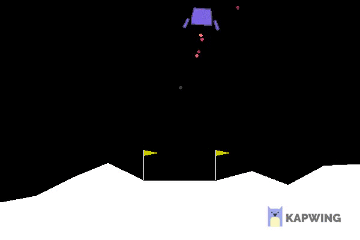

# DQN Agent
Deep Q-Network agent implemented in Python capable of learning to land on the moon in MoonLander-v2 environment from AI Gym library.

  

## Getting Started

These instructions will get you a copy of the project up and running on your local machine for development and testing purposes. See deployment for notes on how to deploy the project on a live system.

### Prerequisites

* Pycharm 2019.x
* Python 3.6
* Tensorflow 1.13
* Keras 2.2.4
* Jupyter Notebook 5.7.8

### Installing

1. Install Python and Pycharm
2. Clone this repository to your local drive
3. Open root directory in Pycharm and let it fetch third-party dependencies from requirements.txt
4. Try to run dqn_example.py. In case of any failures add above versions of Tensorflow, Keras and Jupyter Notebook in the requirements.txt

## Running the tests

1. Open report.ipynb with Jupyter Notebook and try executing code lines

## Deployment

1. After applying changes to any python script, update the content of report.ipynb

## Built With

* [PIP]https://pip.pypa.io/en/stable/) - Python package installer

## Authors

*  [Jakub Gros](https://github.com/jakubgros)
*  [Sebastian Kucharzyk](https://github.com/kucharzyk-sebastian/NES_emulator)

## License

This project is licensed under the MIT License - see the [LICENSE.md](LICENSE.md) file for details

## Acknowledgments

* Code style guide used: PEP 8 (https://www.python.org/dev/peps/pep-0008/) 
